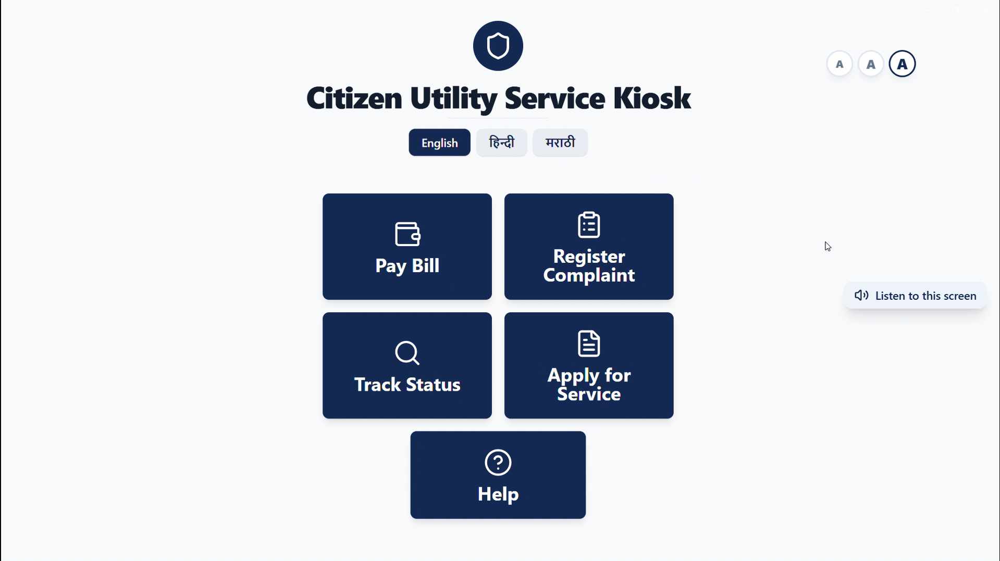

**Citizen Kiosk Hub**



Citizen Kiosk Hub is a multilingual, touch-first kiosk experience that helps citizens pay utility bills, lodge complaints, apply for new connections, and track service requests without needing staff assistance. The UI ships with kiosk-friendly layouts, built-in speech guidance, and OTP-based verification flows tailored for civic deployments in public offices and service centers.

**Key Capabilities**
- Department modules for electricity, gas, water, and municipal services share consistent UX patterns and can easily be extended by adding new entries to the `services` or `departments` arrays under `src/pages`.
- Bill payment flow covers department selection, consumer/mobile authentication, OTP verification, payment method selection, and printable/SMS receipts — see [src/pages/PayBill.tsx](src/pages/PayBill.tsx).
- New service applications guide citizens through Aadhaar, address, and service details with on-screen numeric + QWERTY keyboards — see [src/pages/ApplyForService.tsx](src/pages/ApplyForService.tsx).
- Complaint management supports identity verification, complaint categorization, and free-text capture for electricity, gas, water, and waste departments — see [src/pages/RegisterComplaint.tsx](src/pages/RegisterComplaint.tsx).
- Tracking and help sections let users monitor complaint/service/payment statuses and access multilingual help topics or call center actions — see [src/pages/TrackStatus.tsx](src/pages/TrackStatus.tsx) and [src/pages/Help.tsx](src/pages/Help.tsx).

**Touch-First Experience**
- Persistent kiosk chrome with oversized back/home buttons, progress indicators, and consistent layouts lives in [src/components/KioskLayout.tsx](src/components/KioskLayout.tsx).
- Dedicated numeric and QWERTY keyboards keep all input inside the kiosk shell and remove the need for physical peripherals ([src/components/NumericKeypad.tsx](src/components/NumericKeypad.tsx), [src/components/OnScreenKeyboard.tsx](src/components/OnScreenKeyboard.tsx)).
- The speech button reads screen content aloud so visually impaired or low-literacy citizens can receive guidance without external assistive tech ([src/components/SpeechButton.tsx](src/components/SpeechButton.tsx)).

**Accessibility & Inclusion**
- **Languages**: Instant switching between English, Hindi, and Marathi is powered by [src/context/LanguageContext.tsx](src/context/LanguageContext.tsx) and [src/hooks/useTranslations.ts](src/hooks/useTranslations.ts).
- **Text scaling**: Citizens can enlarge or shrink text globally, with selections persisted via local storage ([src/context/TextScaleContext.tsx](src/context/TextScaleContext.tsx)).
- **Speech guidance**: Screen text is converted to speech using the Web Speech API with locale-aware voices ([src/hooks/useSpeech.ts](src/hooks/useSpeech.ts)).
- **High-contrast UI**: shadcn + Tailwind tokens provide large, high-contrast cards, WCAG-friendly focus states, and kiosk-suitable typography.

**Tech Stack**
- React + TypeScript (Vite)
- Tailwind CSS with shadcn-ui component primitives
- Context/state hooks for language, text scale, speech, and toasts
- Vitest for unit testing (see `src/test`)

**Project Status**
- Stage: Prototype developed — citizen journeys run end-to-end in the kiosk shell.
- Demo: Launch locally with `npm run dev` and open the UI in a Chromium-based kiosk window.
- Repository: Local development workspace (`citizen-kiosk-hub`); ready to push to a remote Git host.

**Deployment & Infrastructure**
| Concern | Detail |
| --- | --- |
| Target environments | Cloud, on-prem kiosk servers, or hybrid; UI outputs static assets for any host. |
| Build | `npm run build` emits static files under `dist/`; serve via static host or embed in an Electron shell. |
| Kiosk hardware | Dual-core CPU, 8 GB RAM, SSD, microphone, speakers, thermal printer, and stable touch display. |
| Connectivity | Medium dependency. OTP/billing APIs require HTTPS; offline mode can be added with service-worker caching plus deferred sync. |

**Local Development**
```sh
git clone https://github.com/RKG01/citizen-kiosk-hub.git
cd citizen-kiosk-hub
npm install
npm run dev   # starts Vite on http://localhost:5173

npm run build # production bundle
npm run test  # vitest unit tests
```

**Security & Data Handling**
- OTP validation is mandatory before showing bill or complaint data, and sensitive inputs stay within component state until submission.
- Only non-sensitive preferences (language, text scale) are stored in `localStorage`; transaction details remain ephemeral unless future APIs persist them.
- Speech playback respects `data-speech-skip="true"` to avoid reading confidential fields aloud.
- Production rollouts should connect to authenticated civic APIs over HTTPS, enforce kiosk-mode OS lockdown, and add rate limiting plus device certificates on the backend. A formal STRIDE review is planned for the next milestone.

**Roadmap**
1. Integrate real OTP/billing/service APIs and queueing for offline transactions.
2. Add voice-input intents for fully hands-free navigation.
3. Perform WCAG/GIGW compliance audit and formal threat modeling.
4. Package installers for Windows/Linux kiosk images.

